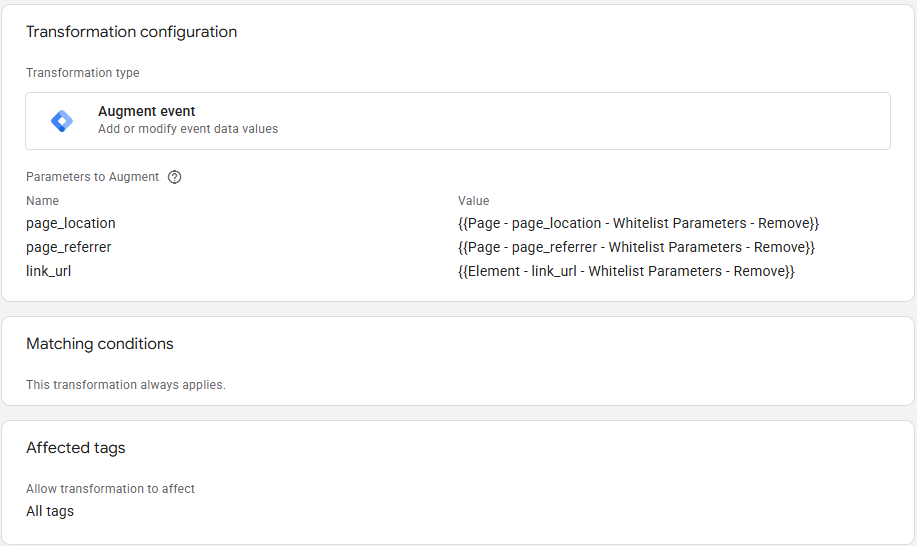
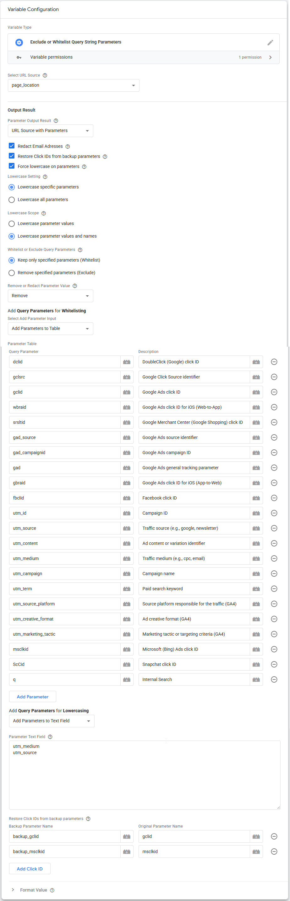
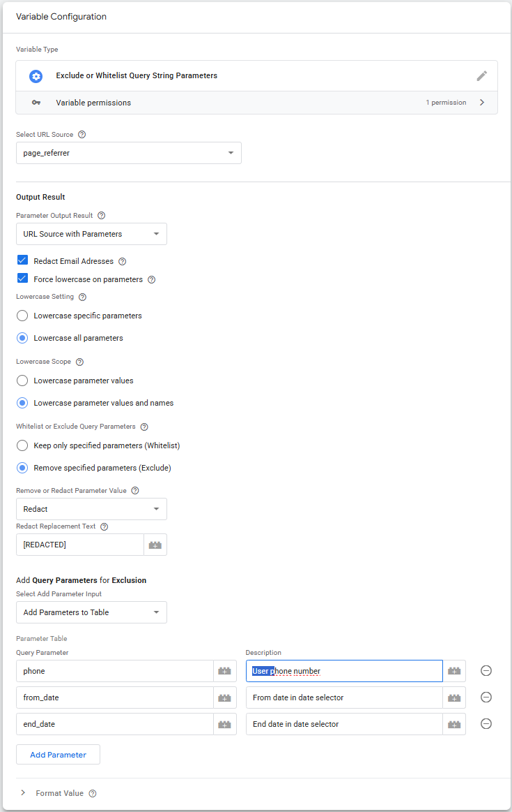
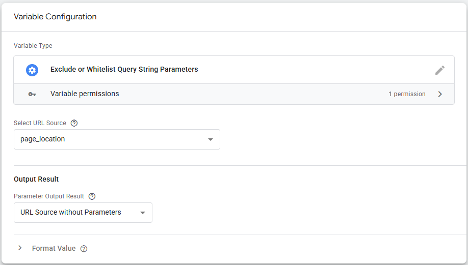

# Exclude or Allowlist (Whitelist) Query String Parameters - SGTM Variable

The most common cause for **Personally Identifiable Information (PII)** leaking into analytics tools is through the URL of the website. 

This **Variable Template** for **Google Tag Manager Server-Side (SGTM)** fixes this problem by making it possible to safely **Exclude** or **Allowlist (Whitelist)** Query String Parameters from URLs before sending them to your marketing or analytics platforms. 

Images of the Template are at the bottom.

This Template is available in the [**Google Tag Manager Template Gallery**](https://tagmanager.google.com/gallery/#/owners/gtm-templates-knowit-experience/templates/sgtm-exclude-whitelist-query-strings).

## Variable Settings

### Select URL Source
You can easily select common Event Data variables from the dropdown list, or use a custom variable.
*   **Event Data: page_location (Default)**
*   **Event Data: page_referrer**
*   **Event Data: link_url**
*   **Custom Variable Input** (Allows you to use any Variable containing a valid URL as input).

### Output Result

| Setting | Example Output |
| ------------- | ------------- |
| URL Source with Parameters | `https://domain.com/path?query=something` |
| URL Source without Parameters | `https://domain.com/path` |
| Source Path with Parameters | `/path?query=something#target` |
| Parameters with Question Mark | `?query=something` |
| Parameters without Question Mark | `query=something` |

*Note: The variable safely preserves URL hash fragments (e.g., `#target`) when reconstructing the URL.*

### Redact Email Addresses
Redact potential email addresses independently of the parameter matching logic. Even Allowlisted (Whitelisted) parameters will be checked and redacted if an email format is detected.

If an email is found, the email address will be replaced with `[EMAIL REDACTED]`.

### Force Lowercase on Parameters
Parameter matching is by default case-sensitive. By enabling this, incoming parameters can be converted to lowercase to help standardize your analytics data (for example, converting `FACEBOOK` to `facebook`).

#### Lowercase Specific Parameters (Recommended):
Instead of lowercasing everything, we highly recommend providing a specific list of parameters to target (such as `utm_source`, `utm_medium`, or `utm_campaign`). Lowercasing all parameters is dangerous because it will break case-sensitive unique identifiers, click IDs (like `fbclid`, `gclid`, `wbraid`), and authentication tokens.

#### Lowercase Scope:
You can choose to safely lowercase just the parameter values (leaving the names exactly as they entered), or lowercase both the parameter names and values.

### Allowlist (Whitelist) or Exclude Query Parameters
You can either **Allowlist (Whitelist)** or **Exclude** parameters using a table or a text field.

*   **Allowlist (Whitelist):** Only parameters listed here are allowed to pass through. This is the **safest option** to prevent PII leakage into your analytics and marketing tools. If you choose this option, it is critical that you add *all* parameters you actually need (e.g., campaign tracking parameters, internal search queries, pagination).
*   **Exclude:** Add specific parameters you **do not want to be passed through** to your analytics tool. This is less "safe" than using an Allowlist, but is a useful method if you only want to block known bad parameters.

**Using the Table:**
When using the table input for your parameters, you can use the **Description** column to document *why* a parameter is being kept or removed (e.g., "Facebook Click ID", "Internal Search Term"). This makes maintaining the variable much easier for your team over time.

### Remove or Redact Parameter Value
*   **Remove:** Removes the parameter and its value entirely from the URL.
*   **Redact:** Keeps the parameter key in the URL, but overwrites the value with a custom redaction text. Example: `query=[REDACTED]`.

---

## Example Setup: Using SGTM Transformations (Recommended)

The most efficient way to use this variable is by leveraging **Transformations** in Server-Side GTM. Transformations allow you to clean the data *before* it is processed by your tags, meaning you don't need to manually configure variables inside every individual GA4 or marketing tag.

### Step-by-Step Guide

**1. Create your cleaning Variables:**
*   Go to **Variables** and create a new variable using this template (e.g., name it `Page - page_location - Whitelist Parameters - Remove`).
*   Set the **Select URL Source** to `Event Data: page_location`.
*   Configure your Allowlist rules and redaction settings.
*   *(Optional)* Repeat this process for `page_referrer` or `link_url` if needed.

**2. Create a Transformation:**
*   Navigate to the **Transformations** tab in your SGTM container.
*   Click **New** and select **Augment Event** as the Transformation type.
*   Under **Parameters to Add or Modify**, add a new row:
    *   **Name:** `page_location`
    *   **Value:** `{{Page - page_location - Whitelist Parameters - Remove}}` (the variable you created in Step 1).
*   *(Optional)* Add rows to modify `page_referrer` or to create a custom audit parameter like `page_query_string` that captures redacted values.

**3. Apply the Transformation:**
*   In the **Matching Conditions** (Triggers) section of the Transformation, choose which events or tags this should apply to (e.g., apply it to all events, or specifically target your GA4 tags).
*   Save and publish.
       
By doing this, any tag that uses the `page_location` event data will automatically receive the cleaned, PII-safe URL, ensuring data compliance seamlessly across all your platforms.

---

## Images of the Variable Template
Variable Template (Server) for Google Tag Manager that Excludes or Allowlists Query String Parameters.

### Whitelist (include) Query Parameters & Lowercase Parameter Values

### Exclude and Redact Query Parameters & Lowercase Parameter Values and Names

### Remove All Query Parameters

